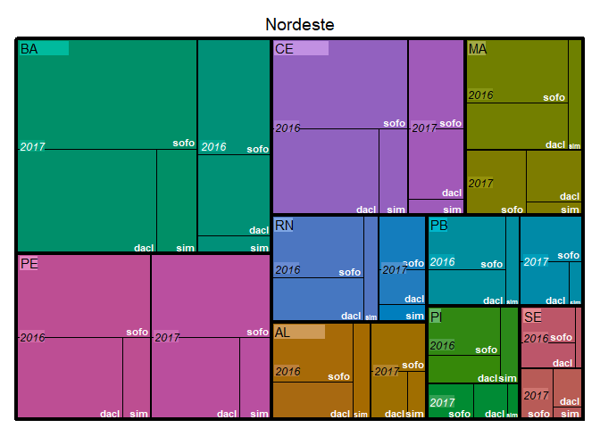
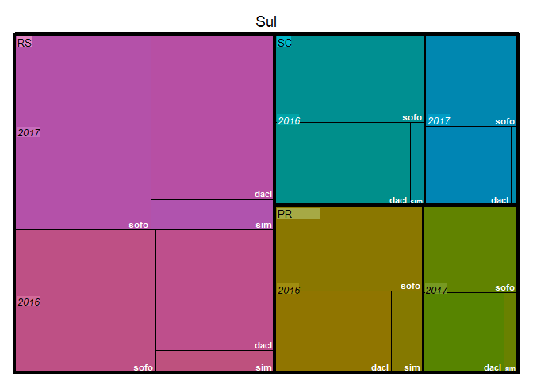
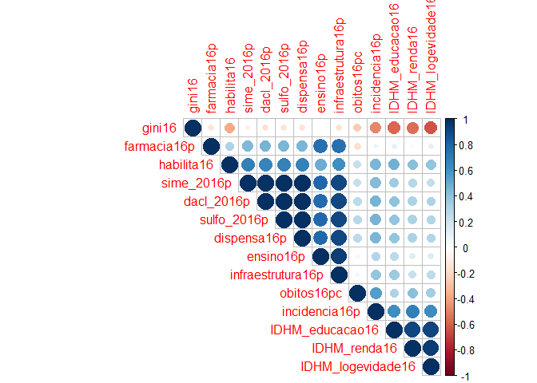
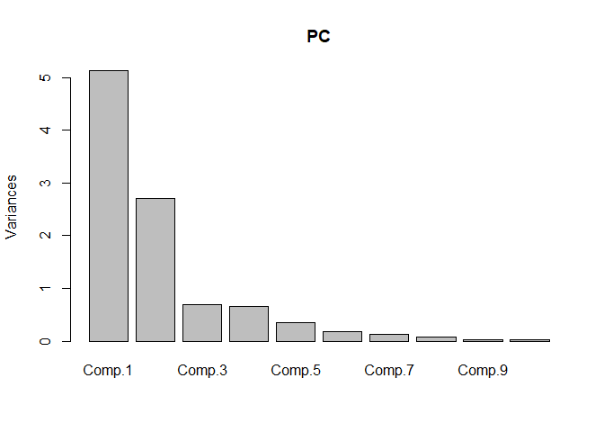

Análise Inteligente dos Dados (Yuri AT)
================

### Introdução

A cronificação da hepatite C (HCV) é considerada um problema de saúde
pública. Logo, sendo o principal objetivo do tratamento erradicar o HCV
e melhorar a qualidade de vida dos pacientes, o monitoramento do
horizonte do tratamento é de suma importância. Assim sendo, em 2015, no
Sistema Único de Saúde (SUS) foram liberados os fármacos sofosbuvir,
daclatasvir e simeprevir para tratamento da Hepatite C dos genótipos 1,
2, 3 e 4 com fibrose avançada e de coinfectados pelo HIV-1. Sendo o
regime terapêutico mais recomendado, a combinação dos fármacos
sofosbuvir+simeprevir ou sofosbuvir+daclatasvir.

\#\#\#\#Objetivo O objetivo dessa análise é comparar o impacto da
inserção da dispensação de novos medicamentos para o tratamento do HCV
nu SUS. As novas recomendaçõe implicam em maior dispensação dos
medicamentos daclastavir, simeprevir e sofosbuvir segundo o regime
terapêutico. Com isso queremos verificar primeiramente **se o protocolo
recomendando está sendo seguido**. E então o quanto o perfil da
dispensação total desses medicamentos varia em cada estado no período
de impletação (entre janeiro de 2016 e dezembro de 2017). Com o
interesse final de estimar dentre o perfil observado quais podem vir a
ser as variáveis secundárias mais explicativas para a mortalidade
estadual do HCV e qual modelo preditivo pode ser aplicado dado as
variáveis secundárias.

\#\#\#\#Descrição dos dados Os dados aqui analisados foram obtidos pela
plataforma online de livre acesso do DATASUS
(<http://tabnet.datasus.gov.br>) e exportados em diferentes tabelas
contendo a quantidade apresentada por local de atendimento na produção
ambulatorial do sus para a combinação de fármacos recomendados no
tratamento da hepatite C. Que são eles o daclastavir (60 mg), sofosbuvir
(60 mg) e simeprevir (150 mg). As colunas de cada tabela foram
subdivididas pelo ano de registro e cada linha corresponde a frequência
apresentada por unidade de federação. Também foram incluidos dados
referentes ao IDH e a infraestrutura para dispensação de fármacos de
cada unidade de federação todos relativizados pela população total de
cada estado ou pela população de incidência em dois conjuntos de dados
diferentes (um parao ano de 2016 e outro para o ano de 2017).

<P style="page-break-before: always">

\#\#\#\#\#Variáveis

**Taxa = variável controlada (dividida) pela potencial população de
risco para HCV- \[1% do estado\]**

1)  uf = sigla referente aos estados (char-fator)
2)  regiao = sigla referente as regiões (char-fator)
3)  obitos16pc = *Logarítimo na base 10* do coeficiente de mortalidade
    por HCV, por 100.000 habitantes (p/ maior normalização)
4)  incidencia16p = Coeficiente de detecção por 100.000 habitantes de
    casos com marcador anti-HCV reagente e HCV-RNA reagente
5)  dacl\_2016 = **Taxa** da dispensação de comprimidos do medicamento
    daclastavir (60 mg)
6)  sulfo\_2016 = **Taxa** da dispensação de comprimidos do medicamento
    sofosbuvir (60 mg)
7)  sime\_2016 = **Taxa** da dispensação de comprimidos do medicamento
    simeprevir (150 mg)
8)  dispensa16p = **Taxa** da dispensação total de comprimidos dos três
    medicamento
9)  farmacia16p = **Taxa** de estabelecimentos de saúde (na PNAF) em que
    é feita a dispensação de medicamentos excepcionais
10) ensino16 = **Taxa** de centros médicos com atividade de ensino
11) infraestrutura16p = **Taxa** do quantitativo geral de
    estabelecimentos de saúde contidos no CNES
12) habilita16 = Estabelecimentos de saúde hablitados a realizar a
    detecção por marcador anti-HCV reagente e HCV-RNA reagente
13) IDHM\_renda = Índice de Desenvolvimento Humano Municipal de Renda
    (2010)
14) IDHM\_logevidade = Índice de Desenvolvimento Humano Municipal de
    Longevidade (2010)
15) IDHM\_educacao = Índice de Desenvolvimento Humano Municipal de
    Educação (2010)
16) gini = Índice de desigualdade estadual em 2010
17) obitos16p = Coeficiente de mortalidade por HCV, por 100.000
    habitantes

</P>

\#\#\#Análise descritiva para protocolo de distribuição dos fármacos

\#\#\#\#\#Representações por mapas de árvore (treemap)

Nossa primeira hipótese foi de que a adesão ao protocolo recomendado
para dispensação dos medicamentos fosse diferente entre os estados e
regiões, dentre os anos de 2016 e 2017. Dado a possíveis problemas de
registro ou da própria infraestrutura e demanda de cada estado. Assim
sendo, para melhor visualizarmos a distribuição das variáveis perante o
protocolo da dispensação dos medicamentos usamos o *treemap* como uma
representação hierárquica da dispensação dos três diferentes
medicamentos primeiramente pelas regiões, então pelos anos e for fim
**categorizadas por cada estado** subdividido em regiões e ano.

<!-- --><!-- --><!-- --><!-- --><!-- --><!-- --><!-- --><!-- -->

Através dos treemaps podemos perceber que em sua maioria o protocolo
recomendado para a dispensação aparenta estar sendo seguido. Dentre os
estados que apresentam certa exceção a regra, temos Roraima, Tocantins e
Mato Grosso do Sul, que apresentam ausência na dispensação de simeprevir
em 2017. Em relação a variação dentre os anos a tendência é que a
dispensação em 2017 seja ligeiramente menor do que a dispensação em
2016, salvo algumas exceções estaduais (como a maior dispensação em 2017
do que em 2016 apresentada pela Bahia e pelo Rio Grande do Sul e grande
queda da dispensação em 2017 no Distrito Federal). Além disso o mapa das
regiões demonstra uma alta dispensação total na região sudeste,
impulsionada pelos estados São Paulo e Rio de Janeiro, o que era de se
esperar dado a infraestrutura para atendimento, alta concentração
populacional e incidência do HCV nesses estados.

No gráfico de barras apresentado abaixo a tendência de menor dispensação
em 2017 é reforçada, mesmo com a inserção de um novo protocolo de
tratamento (combinação 3D liderada por ombitasvir) não influenciando a
proporção do protocolo recomendado anteriormente.

<!-- --><!-- -->

O boxplot acima demonstra a influência do outlier na região sudeste para
a taxa de dispensação, mesmo essa sendo controlada pela população
estadual. Apesar dessa distorção, pelo boxplot podemos observar que as
demais regiões possuem média similares e menor impacto de seus outliers,
seguindo o protocolo de forma correlacionado

\#\#\#\#\#Correlação entre a taxa de dispensação dos diferentes
medicamentos

``` r
cor(hcvdata16[,c(3:5)]) 
```

    ##             dacl_2016p sulfo_2016p sime_2016p
    ## dacl_2016p   1.0000000   0.9994777  0.9887918
    ## sulfo_2016p  0.9994777   1.0000000  0.9922338
    ## sime_2016p   0.9887918   0.9922338  1.0000000

\#\#\#\#\#Considerações iniciais

A própria correlação entre as dispensações dos diferentes medicamentos,
indica que o protocolo recomendado para a dispensação está sendo
seguido. Assim sendo, podemos concluir que, de maneira geral a
dispensação entre os diferentes medicamentos é padronizada entre os
estados sendo mais interessante agregarmos em uma *dispensação total*
para a modelagem.

\#\#\#Análise descritiva para o índice de mortalidade

Logo, precisamos então verificar como as demais variáveis explanatórias
estão distribuidas. Para tal iremos usar a função **summary** e a
*correlação* entre essas variáveis, dado que através delas podemos ter
uma visualização primária de quais varíaveis apresentam maior correlação
com a taxa de mortalidade, variável de saída que almejamos compreender e
predizer. Para a variável de interesse (mortalidade) precisamos
verificar que tipo de distribuição está sendo seguida, para melhor
entender qual modelo melhor se aplica ao caso. Para tal iremos usar o
histograma e consequentes testes para uma distribuição normal (dado que
temos a mortalidade de 27 estados)

``` r
#Resumo dos dados de 2016
summary(hcvdata16)
```

    ##       uf16    regiao16   dacl_2016p        sulfo_2016p        sime_2016p     
    ##  AC     : 1   CO:4     Min.   :   2.539   Min.   :   0.00   Min.   :  0.000  
    ##  AL     : 1   NE:9     1st Qu.:  20.815   1st Qu.:  23.16   1st Qu.:  5.857  
    ##  AM     : 1   NO:7     Median :  59.161   Median :  75.62   Median : 18.741  
    ##  AP     : 1   SE:4     Mean   : 212.383   Mean   : 279.20   Mean   : 54.471  
    ##  BA     : 1   SU:3     3rd Qu.: 151.477   3rd Qu.: 221.66   3rd Qu.: 48.524  
    ##  CE     : 1            Max.   :2635.568   Max.   :3510.39   Max.   :692.693  
    ##  (Other):21                                                                  
    ##    obitos16pc       incidencia16p     dispensa16p        farmacia16p      
    ##  Min.   :-0.52288   Min.   : 0.300   Min.   :   5.417   Min.   :0.002658  
    ##  1st Qu.:-0.39794   1st Qu.: 1.300   1st Qu.:  53.346   1st Qu.:0.031555  
    ##  Median :-0.22185   Median : 2.600   Median : 149.204   Median :0.077511  
    ##  Mean   :-0.18469   Mean   : 4.215   Mean   : 546.053   Mean   :0.224771  
    ##  3rd Qu.:-0.02288   3rd Qu.: 4.050   3rd Qu.: 439.095   3rd Qu.:0.260317  
    ##  Max.   : 0.53148   Max.   :22.500   Max.   :6838.647   Max.   :1.393336  
    ##                                                                           
    ##    ensino16p       infraestrutura16p    habilita16      IDHM_renda16   
    ##  Min.   :0.00443   Min.   :  0.5201   Min.   : 0.000   Min.   :0.6120  
    ##  1st Qu.:0.06995   1st Qu.:  5.3859   1st Qu.: 1.000   1st Qu.:0.6670  
    ##  Median :0.18810   Median : 14.9530   Median : 1.000   Median :0.6940  
    ##  Mean   :0.38349   Mean   : 29.0603   Mean   : 1.926   Mean   :0.7069  
    ##  3rd Qu.:0.41502   3rd Qu.: 30.3133   3rd Qu.: 2.000   3rd Qu.:0.7425  
    ##  Max.   :2.22657   Max.   :218.2645   Max.   :11.000   Max.   :0.8630  
    ##                                                                        
    ##  IDHM_logevidade16 IDHM_educacao16      gini16         obitos16p     
    ##  Min.   :0.7550    Min.   :0.5200   Min.   :0.4900   Min.   :0.0000  
    ##  1st Qu.:0.7860    1st Qu.:0.5605   1st Qu.:0.5600   1st Qu.:0.3500  
    ##  Median :0.8050    Median :0.6240   Median :0.6000   Median :0.5000  
    ##  Mean   :0.8086    Mean   :0.6124   Mean   :0.5907   Mean   :0.7741  
    ##  3rd Qu.:0.8340    3rd Qu.:0.6440   3rd Qu.:0.6200   3rd Qu.:0.8000  
    ##  Max.   :0.8730    Max.   :0.7420   Max.   :0.6500   Max.   :3.4000  
    ## 

\#\#\#\#\#Verificando distribuição do índice de mortalidade controlado X
não controlado.

<!-- -->

    ## 
    ##  Shapiro-Wilk normality test
    ## 
    ## data:  hcvdata16$obitos16p
    ## W = 0.68457, p-value = 2.383e-06

    ## 
    ##  Shapiro-Wilk normality test
    ## 
    ## data:  log_hcvdata16$obitos16p
    ## W = 0.94527, p-value = 0.1643

<!-- -->

Pelos gráficos e pelo resultado do Shapiro-test no índice de mortalidade
transformado (p \> 0.05), podemos observar que o índice de mortalidade
passa a seguir uma distribuição normal. A transformação aqui utilizada
foi a aplicação do logarítimo na base 10 do índice de mortalidade
multiplicado por 10, de forma a manter a escala positiva e reduzir o
impacto dos valores extremos que já eram esperados na distribuição
devido ao perfil díspare de alguns estados. A mesma transformação foi
aplicada nas demais variáveis numéricas, visto que todas sofrem as
mesmas influências estaduais, com isso podemos melhor verificar a
correlação presente entre as variáveis

\#\#\#\#\#Correlação por cores e tamanho dentre as variáveis numéricas

``` r
x <- cor(hcvdata16[3:16])
corrplot(x, type="upper", order="hclust")
```

<!-- -->

Nesse gráfico podemos confirmar algumas correlações esperadas, como a
correlação dentre os IDH’s e dentre as dispensações dos medicamentos
isoladamente em comparação a dispensação total, que é uma combinação
linear desses. Além disso podemos observar que o índice de mortalidade
(obitos16pc) possui maior correlação com fatores de incidência,
infraestrutura, dispensação e o índice de Gini (negativamente). Assim
sendo, no gráfico a seguir observamos o perfil de distribuição dessas
variáveis (**transformadas pelo logarítmo na base 10**) que aparentaam
estar mais interligadas com o índice de mortalidade, bem como a
correlação entre elas de forma gráfica e numérica.

\#\#\#\#\#Distruibuição e correlação entre as variáveis que parecem mais
interligadas à mortalidade

``` r
#Gráfico de distruibuição e correlação entre as variáveis que parecem estar mais interligadas ao ínidice de mortalidade 
chart.Correlation(subset(log_hcvdata16, select = c(obitos16p,incidencia16p,dispensa16p,infraestrutura16p,gini16)))
```

<!-- -->

\#\#\#\#Análise dos outliers

Mesmo com as transformações aplicadas, ainda poderiam existir outliers
multivariados que comprometessem o uso de alguma modelagem, para
verificá-los usamos a distância de Mahalanobis que não assume a
ausência de covariância em seu cálculo. observados na taxa de
mortalidade também aparentam afetar as varíaveis secundárias de maior
correlação com a taxa de mortalidade, sendo realmente mais interessante
removê-los do banco de dados para melhor análise.

<!-- -->

    ##        RO        AC        AM        RR        PA        AP        TO        MA 
    ## 15.779496 15.842049 11.589838 15.886545  9.645849  7.836514 10.326232  8.906016 
    ##        PI        CE        RN        PB        PE        AL        SE        BA 
    ## 15.328480 13.037268  5.421475  3.467773  5.216831 17.207482 10.953837  8.025212 
    ##        MG        ES        RJ        SP        PR        SC        RS        MS 
    ## 11.333967  2.972366  6.007608 14.771877  9.401879 14.945491 13.140841  4.476583 
    ##        MT        GO        DF 
    ##  9.187514  6.166817 19.124162

Por esse gráfico podemos observar que os estados que mais se distanciam
do centro são Rondônia, Roraima, Acre, Alagoas e o Distrito Federal, o
que é de certa forma coerente com o observado anteriormente nos
*treemaps*. Além de demonstrar que a tranformação das variáveis diminuiu
o impacto dos estados do Rio de Janeiro e São Paulo. O que se torna
ainda mais evidente no scatterplot abaixo que com a **remoção dos
outliers**, inclui a dispensação pela infraestrura crescente de forma
aproximadamente linear dentre todas as regiões e uma tendência a maiores
índices de mortalidade com o aumento da dispensação, podendo essa estar
indicando a gravidade do HCV por localidade.

    ## `geom_smooth()` using formula 'y ~ x'

<!-- -->

\#\#\#Regressão linear múltipla O scatterplot de impacto da
infraestrutura com a dispensão de fármacos na taxa de mortalidade por
região parecia ter um tendência a correlação linearidade. Assim sendo,
testamos o modelo linear tratando os dados de 2017 como os dados de
teste e os dados de 2016 como os dados de treinamento e comparamos esses
resultados com os gerados pela subdivisão do banco de dados de 2016 em
70% treinamento e 30% teste.

\#\#\#\#Definindo os conjuntos de treinamento e teste

``` r
#----Grupos de treinamento (banco de 2016) e teste (banco de 2017)
ta16 <- rl16
te17 <- rl17
dim(ta16)
```

    ## [1] 27 12

``` r
dim(te17)
```

    ## [1] 27 12

``` r
#------Grupos de treinamento (70%) e teste (30%)
set.seed(314)
indexes <- sample (1:nrow(rl16), size=.3*nrow(rl16))
hcv16test <- rl16[indexes,]
hcv16train <- rl16[-indexes,]
dim(hcv16test)
```

    ## [1]  8 12

``` r
dim(hcv16train)
```

    ## [1] 19 12

\#\#\#\#Modelo linear com banco de dados de 2016 completo

``` r
modelo0 = lm(rl16$obitos16p ~., data=rl16)
summary(modelo0)
```

    ## 
    ## Call:
    ## lm(formula = rl16$obitos16p ~ ., data = rl16)
    ## 
    ## Residuals:
    ##      Min       1Q   Median       3Q      Max 
    ## -0.41250 -0.03853  0.01818  0.07500  0.23192 
    ## 
    ## Coefficients:
    ##                   Estimate Std. Error t value Pr(>|t|)    
    ## (Intercept)        1.63792    3.17534   0.516 0.615348    
    ## regiao16NE        -0.06733    0.28697  -0.235 0.818449    
    ## regiao16NO        -0.26448    0.28024  -0.944 0.363906    
    ## regiao16SE        -0.01896    0.20005  -0.095 0.926048    
    ## regiao16SU        -0.04751    0.23374  -0.203 0.842345    
    ## incidencia16p      0.17538    0.18986   0.924 0.373822    
    ## dispensa16p        0.81044    0.14876   5.448 0.000148 ***
    ## farmacia16p        0.06838    0.18898   0.362 0.723755    
    ## ensino16p         -0.07987    0.23794  -0.336 0.742924    
    ## infraestrutura16p -0.79358    0.46425  -1.709 0.113088    
    ## habilita16         0.01552    0.02354   0.660 0.521974    
    ## IDHM_renda16       3.43180    3.19347   1.075 0.303673    
    ## IDHM_logevidade16  0.86894    5.86390   0.148 0.884658    
    ## IDHM_educacao16   -6.06292    2.07891  -2.916 0.012927 *  
    ## gini16            -2.32947    2.68590  -0.867 0.402790    
    ## ---
    ## Signif. codes:  0 '***' 0.001 '**' 0.01 '*' 0.05 '.' 0.1 ' ' 1
    ## 
    ## Residual standard error: 0.1904 on 12 degrees of freedom
    ## Multiple R-squared:  0.8701, Adjusted R-squared:  0.7186 
    ## F-statistic: 5.743 on 14 and 12 DF,  p-value: 0.002194

``` r
#ANOVA do modelo
anova(modelo0)
```

    ## Analysis of Variance Table
    ## 
    ## Response: rl16$obitos16p
    ##                   Df  Sum Sq Mean Sq F value    Pr(>F)    
    ## regiao16           4 0.89293 0.22323  6.1578 0.0062220 ** 
    ## incidencia16p      1 0.03498 0.03498  0.9650 0.3453263    
    ## dispensa16p        1 0.52804 0.52804 14.5658 0.0024550 ** 
    ## farmacia16p        1 0.10633 0.10633  2.9331 0.1124763    
    ## ensino16p          1 0.69434 0.69434 19.1532 0.0009019 ***
    ## infraestrutura16p  1 0.24786 0.24786  6.8371 0.0226011 *  
    ## habilita16         1 0.00201 0.00201  0.0555 0.8176790    
    ## IDHM_renda16       1 0.00507 0.00507  0.1399 0.7148902    
    ## IDHM_logevidade16  1 0.09292 0.09292  2.5632 0.1353615    
    ## IDHM_educacao16    1 0.28320 0.28320  7.8119 0.0161943 *  
    ## gini16             1 0.02727 0.02727  0.7522 0.4027899    
    ## Residuals         12 0.43502 0.03625                      
    ## ---
    ## Signif. codes:  0 '***' 0.001 '**' 0.01 '*' 0.05 '.' 0.1 ' ' 1

``` r
## Importância das variáveis
varImp(modelo0)
```

    ##                      Overall
    ## regiao16NE        0.23463313
    ## regiao16NO        0.94376149
    ## regiao16SE        0.09478712
    ## regiao16SU        0.20325020
    ## incidencia16p     0.92374369
    ## dispensa16p       5.44785181
    ## farmacia16p       0.36185081
    ## ensino16p         0.33565817
    ## infraestrutura16p 1.70939001
    ## habilita16        0.65959048
    ## IDHM_renda16      1.07463102
    ## IDHM_logevidade16 0.14818417
    ## IDHM_educacao16   2.91639175
    ## gini16            0.86729635

``` r
par(mfrow=c(2,2))
plot(modelo0)
```

<!-- -->

\#\#\#\#Modelo linear subdividindo o mesmo grupo

``` r
modelo1 = lm(hcv16train$obitos16p ~., data=hcv16train)
summary(modelo1)
```

    ## 
    ## Call:
    ## lm(formula = hcv16train$obitos16p ~ ., data = hcv16train)
    ## 
    ## Residuals:
    ##         1         4         5         6         8         9        10        11 
    ## -0.008229 -0.094096  0.009021  0.093304 -0.030012 -0.024575  0.047798  0.028442 
    ##        15        16        17        18        19        21        22        23 
    ##  0.016775 -0.038427 -0.021478  0.079986 -0.058508  0.038099 -0.091003  0.052904 
    ##        24        25        27 
    ## -0.015431  0.004746  0.010684 
    ## 
    ## Coefficients:
    ##                    Estimate Std. Error t value Pr(>|t|)   
    ## (Intercept)        4.264978   3.161578   1.349  0.24864   
    ## regiao16NE        -0.315370   0.211626  -1.490  0.21042   
    ## regiao16NO        -0.610498   0.230858  -2.644  0.05731 . 
    ## regiao16SE        -0.084885   0.146500  -0.579  0.59337   
    ## regiao16SU        -0.095335   0.276113  -0.345  0.74728   
    ## incidencia16p      0.411738   0.194013   2.122  0.10109   
    ## dispensa16p        1.028981   0.212715   4.837  0.00842 **
    ## farmacia16p        0.145407   0.173012   0.840  0.44796   
    ## ensino16p          0.033919   0.229386   0.148  0.88960   
    ## infraestrutura16p -1.176602   0.381709  -3.082  0.03684 * 
    ## habilita16         0.003402   0.021096   0.161  0.87970   
    ## IDHM_renda16       3.278035   2.298153   1.426  0.22691   
    ## IDHM_logevidade16 -1.621433   4.983451  -0.325  0.76121   
    ## IDHM_educacao16   -8.174394   1.508718  -5.418  0.00562 **
    ## gini16            -1.008612   2.522086  -0.400  0.70966   
    ## ---
    ## Signif. codes:  0 '***' 0.001 '**' 0.01 '*' 0.05 '.' 0.1 ' ' 1
    ## 
    ## Residual standard error: 0.1087 on 4 degrees of freedom
    ## Multiple R-squared:  0.9738, Adjusted R-squared:  0.8822 
    ## F-statistic: 10.63 on 14 and 4 DF,  p-value: 0.01727

``` r
#ANOVA do modelo
anova(modelo1)
```

    ## Analysis of Variance Table
    ## 
    ## Response: hcv16train$obitos16p
    ##                   Df  Sum Sq Mean Sq F value   Pr(>F)   
    ## regiao16           4 0.78503 0.19626 16.6130 0.009305 **
    ## incidencia16p      1 0.00312 0.00312  0.2637 0.634636   
    ## dispensa16p        1 0.08606 0.08606  7.2850 0.054147 . 
    ## farmacia16p        1 0.00276 0.00276  0.2337 0.654097   
    ## ensino16p          1 0.02746 0.02746  2.3244 0.202044   
    ## infraestrutura16p  1 0.22654 0.22654 19.1761 0.011884 * 
    ## habilita16         1 0.00429 0.00429  0.3634 0.579154   
    ## IDHM_renda16       1 0.00143 0.00143  0.1213 0.745182   
    ## IDHM_logevidade16  1 0.26273 0.26273 22.2400 0.009199 **
    ## IDHM_educacao16    1 0.35701 0.35701 30.2206 0.005337 **
    ## gini16             1 0.00189 0.00189  0.1599 0.709657   
    ## Residuals          4 0.04725 0.01181                    
    ## ---
    ## Signif. codes:  0 '***' 0.001 '**' 0.01 '*' 0.05 '.' 0.1 ' ' 1

``` r
## Importância das variáveis
varImp(modelo1)
```

    ##                     Overall
    ## regiao16NE        1.4902190
    ## regiao16NO        2.6444774
    ## regiao16SE        0.5794176
    ## regiao16SU        0.3452765
    ## incidencia16p     2.1222146
    ## dispensa16p       4.8373629
    ## farmacia16p       0.8404479
    ## ensino16p         0.1478680
    ## infraestrutura16p 3.0824595
    ## habilita16        0.1612624
    ## IDHM_renda16      1.4263780
    ## IDHM_logevidade16 0.3253634
    ## IDHM_educacao16   5.4181068
    ## gini16            0.3999116

``` r
par(mfrow=c(2,2))
plot(modelo1)
```

<!-- -->

\#\#\#\#Comparando modelos lineares

<!-- -->

\#\#\#\#\#correlação no modelo de predição em 2017

    ## [1] 0.8406145

    ##      RMSE  Rsquared       MAE 
    ## 1.8288407 0.7066328 1.8161418

\#\#\#\#\#correlação no modelo de predição em subgrupo

    ## [1] 0.8342778

    ##      RMSE  Rsquared       MAE 
    ## 0.3298898 0.6960195 0.2414761

No modelo de regressão linear múltipla com o banco de dados de 2016
completo, observamos um r² ajustado maior que 0.5 no qual a dispensação
e o IDHM de educação eram significativamente importantes para a
formulação do modelo. Como a amostra (27 estados) é uma amostra
relativamente pequena, podemos observar que a subdivisão em grupo de
teste e treinamento altera a performance do modelo, reduzindo o r². Já
para analisar a capacidade de predição dos modelos usamos os indicadores
MAE e RMSE que podem ser usados juntos para diagnosticar variações e
erros em um conjunto de previssão por regressão. Sendo o RMSE sempre
maior ou igual ao MAE e quanto maior a diferença entre eles, maior a
variação nos erros individualmente. Quanto menor os valores de MAE e
RMSE melhor. Logo, o modelo de predição com os dados de 2017 apresenta
boa correlação e bons índices. O que também parece ser o caso para a
predição no subgrupo. Contudo, como a redução de variáveis deixara o
modelo de treinamento pior ajustado, a capacidade de predição para o
grupo teste torna-se inconclusiva.

\#\#\#Componentes principais (PCA) para distinguir as variáveis mais
relevantes Eliminando as dispensações de cada um dos fármacos da
análise, as regiões e a taxa de mortalidade não normalizada, restam 11
variáveis que podem potencialmente explicar o indíce de mortalidade por
hepatite C, para melhor analisar a relevância e as possíveis correlações
entre cada uma delas iremos aplicar a técnica de componentes principais.

``` r
PC <- princomp(log_hcvdata16[7:16],cor=TRUE, scores=TRUE, fix_sign=TRUE)
#attributes(PC)
summary(PC)
```

    ## Importance of components:
    ##                           Comp.1    Comp.2     Comp.3     Comp.4     Comp.5
    ## Standard deviation     2.2645647 1.6479121 0.83413276 0.80928738 0.59129481
    ## Proportion of Variance 0.5128253 0.2715614 0.06957775 0.06549461 0.03496296
    ## Cumulative Proportion  0.5128253 0.7843868 0.85396450 0.91945911 0.95442206
    ##                            Comp.6     Comp.7      Comp.8      Comp.9
    ## Standard deviation     0.43247225 0.36429708 0.279332888 0.185847217
    ## Proportion of Variance 0.01870322 0.01327124 0.007802686 0.003453919
    ## Cumulative Proportion  0.97312529 0.98639652 0.994199210 0.997653128
    ##                            Comp.10
    ## Standard deviation     0.153195028
    ## Proportion of Variance 0.002346872
    ## Cumulative Proportion  1.000000000

``` r
boxplot(PC$scores)
```

<!-- -->

``` r
screeplot(PC) # No. CPs relevantes
```

<!-- -->

``` r
print(PC$loadings)
```

    ## 
    ## Loadings:
    ##                   Comp.1 Comp.2 Comp.3 Comp.4 Comp.5 Comp.6 Comp.7 Comp.8
    ## incidencia16p      0.322  0.264         0.141  0.862         0.172       
    ## dispensa16p        0.332 -0.327  0.218                0.560 -0.567  0.252
    ## farmacia16p        0.235 -0.434 -0.422                0.319  0.640       
    ## ensino16p          0.289 -0.408  0.193               -0.639        -0.161
    ## infraestrutura16p  0.327 -0.392                      -0.201              
    ## habilita16         0.290         0.106  0.901 -0.274               -0.104
    ## IDHM_renda16       0.354  0.309  0.200 -0.209         0.114        -0.540
    ## IDHM_logevidade16  0.358  0.286        -0.281 -0.348  0.154        -0.197
    ## IDHM_educacao16    0.348  0.319  0.172        -0.203 -0.242  0.185  0.749
    ## gini16            -0.285 -0.189  0.807                0.186  0.433       
    ##                   Comp.9 Comp.10
    ## incidencia16p      0.157        
    ## dispensa16p       -0.108  0.119 
    ## farmacia16p       -0.193  0.123 
    ## ensino16p         -0.157  0.484 
    ## infraestrutura16p  0.400 -0.723 
    ## habilita16                      
    ## IDHM_renda16      -0.557 -0.263 
    ## IDHM_logevidade16  0.625  0.358 
    ## IDHM_educacao16   -0.184        
    ## gini16                          
    ## 
    ##                Comp.1 Comp.2 Comp.3 Comp.4 Comp.5 Comp.6 Comp.7 Comp.8 Comp.9
    ## SS loadings       1.0    1.0    1.0    1.0    1.0    1.0    1.0    1.0    1.0
    ## Proportion Var    0.1    0.1    0.1    0.1    0.1    0.1    0.1    0.1    0.1
    ## Cumulative Var    0.1    0.2    0.3    0.4    0.5    0.6    0.7    0.8    0.9
    ##                Comp.10
    ## SS loadings        1.0
    ## Proportion Var     0.1
    ## Cumulative Var     1.0

``` r
biplot (PC, cex= c(.5,1)) 
```

<!-- -->

``` r
### PCA - prcomp()
PrC <- prcomp(log_hcvdata16[7:16], retx = FALSE, center = TRUE, scale. = TRUE,
              tol = NULL, rank. = 5)
PrC$rotation
```

    ##                          PC1         PC2         PC3         PC4         PC5
    ## incidencia16p     -0.3218188  0.26449873 -0.03564261  0.14083688 -0.86150679
    ## dispensa16p       -0.3317852 -0.32651079 -0.21759988 -0.08240154 -0.06462018
    ## farmacia16p       -0.2351649 -0.43351480  0.42198073 -0.09637773  0.04626016
    ## ensino16p         -0.2887846 -0.40841365 -0.19303547 -0.09799664 -0.07039670
    ## infraestrutura16p -0.3270742 -0.39242327 -0.04233414 -0.09708005 -0.01653404
    ## habilita16        -0.2901064 -0.01805727 -0.10646001  0.90099174  0.27424663
    ## IDHM_renda16      -0.3541940  0.30902182 -0.19999266 -0.20937446  0.09106109
    ## IDHM_logevidade16 -0.3581775  0.28585172 -0.04105257 -0.28129833  0.34782409
    ## IDHM_educacao16   -0.3484499  0.31878596 -0.17166550 -0.09392134  0.20317450
    ## gini16             0.2852210 -0.18852603 -0.80732406 -0.03853138 -0.02228023

``` r
# Salvar  as 5 componentes principais
#2016
cph16 <<- within(rl16, {
  PC5_incidencia <- PC$scores[,5]
  PC4_habilitacao <- PC$scores[,4]
  PC3_gini <- PC$scores[,3]
  PC2_estrutural <- PC$scores[,2]
  PC1_social <- PC$scores[,1]})
cph16 <- cph16[, -c(2:11)]

#2017
PC17 <- princomp(rl17[3:12],cor=TRUE, scores=TRUE, fix_sign=TRUE)
cph17 <<- within(rl17, {
  PC17_5_incidencia <- PC17$scores[,5]
  PC17_4_habilitacao <- PC17$scores[,4]
  PC17_3_gini <- PC17$scores[,3]
  PC17_2_estrutural <- PC17$scores[,2]
  PC17_1_social <- PC17$scores[,1]})
cph17 <- cph17[, -c(2:11)]
```

A PCA indica que separar os IDHM por renda, longevidade e educação não
seria relevante, e que as variáveis coeficiente de Gini, taxa de
farmácias especializadas, taxa de infraestrutura, número de centro
habilitados e dispensação são as variáveis que melhor explicam os
principais componentes. Podemos então trabalhar com as componentes
salvas para a modelagem.

\#\#\#\#\#\#Componentes salvas

1)  PC1\_social = impactada pelos IDH’s estaduais (explica 0.51)
2)  PC2\_estrutural = impactada pelo log das taxas de dispensação,
    farmácias, centros de ensino especializados e infraestrura geral
    (explica 0.27)
3)  PC3\_gini = impactada principalmente pelo coeficiente de Gini
    (explica 0.07)
4)  PC4\_habilitacao = impactada principalmente pelos centros
    habilitados à realizar testes para o HCV (explica 0.06)
5)  PC5\_incidencia = impactado pelo log da taxa de incidência (explica
    0.03)

\#\#\#\#Regressão linear com componentes principais

``` r
modelocp = lm(cph16$obitos16p ~., data=cph16)
summary(modelocp)
```

    ## 
    ## Call:
    ## lm(formula = cph16$obitos16p ~ ., data = cph16)
    ## 
    ## Residuals:
    ##      Min       1Q   Median       3Q      Max 
    ## -0.58856 -0.10793 -0.00491  0.20083  0.55929 
    ## 
    ## Coefficients:
    ##                 Estimate Std. Error t value Pr(>|t|)   
    ## (Intercept)      0.99964    0.25567   3.910  0.00113 **
    ## regiao16NE      -0.62877    0.41102  -1.530  0.14447   
    ## regiao16NO      -0.35760    0.34287  -1.043  0.31157   
    ## regiao16SE       0.09718    0.30579   0.318  0.75450   
    ## regiao16SU       0.26551    0.34213   0.776  0.44837   
    ## PC1_social      -0.04299    0.07485  -0.574  0.57326   
    ## PC2_estrutural  -0.08151    0.05827  -1.399  0.17983   
    ## PC3_gini         0.05458    0.09241   0.591  0.56254   
    ## PC4_habilitacao  0.07547    0.10413   0.725  0.47847   
    ## PC5_incidencia   0.19839    0.13012   1.525  0.14571   
    ## ---
    ## Signif. codes:  0 '***' 0.001 '**' 0.01 '*' 0.05 '.' 0.1 ' ' 1
    ## 
    ## Residual standard error: 0.3414 on 17 degrees of freedom
    ## Multiple R-squared:  0.4085, Adjusted R-squared:  0.09542 
    ## F-statistic: 1.305 on 9 and 17 DF,  p-value: 0.3039

``` r
#ANOVA do modelo
anova(modelocp)
```

    ## Analysis of Variance Table
    ## 
    ## Response: cph16$obitos16p
    ##                 Df  Sum Sq  Mean Sq F value Pr(>F)
    ## regiao16         4 0.89293 0.223231  1.9153 0.1541
    ## PC1_social       1 0.04443 0.044430  0.3812 0.5451
    ## PC2_estrutural   1 0.09266 0.092658  0.7950 0.3850
    ## PC3_gini         1 0.04311 0.043110  0.3699 0.5511
    ## PC4_habilitacao  1 0.02452 0.024519  0.2104 0.6523
    ## PC5_incidencia   1 0.27096 0.270958  2.3248 0.1457
    ## Residuals       17 1.98136 0.116550

``` r
## Importância das variáveis
varImp(modelocp)
```

    ##                   Overall
    ## regiao16NE      1.5297710
    ## regiao16NO      1.0429704
    ## regiao16SE      0.3178045
    ## regiao16SU      0.7760666
    ## PC1_social      0.5743360
    ## PC2_estrutural  1.3988681
    ## PC3_gini        0.5906270
    ## PC4_habilitacao 0.7247334
    ## PC5_incidencia  1.5247333

``` r
par(mfrow=c(2,2))
plot(modelocp)
```

<!-- -->

<!-- -->

    ## [1] 0.4982394

    ##      RMSE  Rsquared       MAE 
    ## 0.3436733 0.2482425 0.2501726

O r² ajustado da regressão linear múltipla com as componentes principais
demonstra que essas não parecem explicar o índice de mortalidade. Logo,
podemos observar que a covariância entre as variavéis que compõem o
modelo, quando tratadas separadamente (como nas regressões anteriores)
geram resultados díspares.

\#\#\#Árvore de regressão A árvore de regressão para variáveis de saída
numéricas possui fórmula similar a utilizada nas regressões acima,
contudo através dela também podemos analisar o impacto de fatores não
numéricos (como as regiões) e ter uma visão mais gráfica das subdivisões
geradas pela variação nos dados. Na construção do gráfico da árvore cada
ramo apresenta a porcentagem de variáveis contidas naquele ramo que
apresentam a mesma média na variável resposta, de forma crescente.

\#\#\#\#\#Árvore com banco de dados de 2016 completo

``` r
fit <- rpart(rl16$obitos16p~ .,
             method="anova", data=rl16, minsplit = 2, minbucket = 1)
rpart.plot(fit)
```

<!-- -->

``` r
summary(fit)
```

    ## Call:
    ## rpart(formula = rl16$obitos16p ~ ., data = rl16, method = "anova", 
    ##     minsplit = 2, minbucket = 1)
    ##   n= 27 
    ## 
    ##            CP nsplit  rel error    xerror      xstd
    ## 1  0.42471839      0 1.00000000 1.0943600 0.3318306
    ## 2  0.15373834      1 0.57528161 0.9367577 0.3072983
    ## 3  0.08307385      2 0.42154327 1.0699520 0.2850774
    ## 4  0.07340968      3 0.33846942 1.1613438 0.2932710
    ## 5  0.07213547      4 0.26505974 1.1243693 0.2881664
    ## 6  0.05763829      5 0.19292427 1.2428105 0.2888468
    ## 7  0.04566733      6 0.13528598 1.3169170 0.3113675
    ## 8  0.03746632      7 0.08961865 1.3164854 0.3070725
    ## 9  0.02330710      8 0.05215233 1.1624064 0.2515405
    ## 10 0.01000000      9 0.02884524 1.2083458 0.2684595
    ## 
    ## Variable importance
    ##     incidencia16p      IDHM_renda16 IDHM_logevidade16   IDHM_educacao16 
    ##                16                15                13                11 
    ##       dispensa16p          regiao16         ensino16p        habilita16 
    ##                 9                 9                 7                 6 
    ## infraestrutura16p       farmacia16p            gini16 
    ##                 6                 5                 2 
    ## 
    ## Node number 1: 27 observations,    complexity param=0.4247184
    ##   mean=0.7412403, MSE=0.1240725 
    ##   left son=2 (18 obs) right son=3 (9 obs)
    ##   Primary splits:
    ##       incidencia16p     < 1.497818   to the left,  improve=0.4247184, (0 missing)
    ##       dispensa16p       < 2.349971   to the left,  improve=0.3115434, (0 missing)
    ##       IDHM_renda16      < 0.736      to the left,  improve=0.2714346, (0 missing)
    ##       IDHM_logevidade16 < 0.824      to the left,  improve=0.2493839, (0 missing)
    ##       gini16            < 0.595      to the right, improve=0.2486980, (0 missing)
    ##   Surrogate splits:
    ##       IDHM_renda16      < 0.75       to the left,  agree=0.889, adj=0.667, (0 split)
    ##       regiao16          splits as  LLLRR, agree=0.852, adj=0.556, (0 split)
    ##       IDHM_logevidade16 < 0.8285     to the left,  agree=0.852, adj=0.556, (0 split)
    ##       IDHM_educacao16   < 0.6365     to the left,  agree=0.852, adj=0.556, (0 split)
    ##       habilita16        < 3.5        to the left,  agree=0.815, adj=0.444, (0 split)
    ## 
    ## Node number 2: 18 observations,    complexity param=0.1537383
    ##   mean=0.5789198, MSE=0.06480826 
    ##   left son=4 (3 obs) right son=5 (15 obs)
    ##   Primary splits:
    ##       dispensa16p       < 2.313718   to the left,  improve=0.4414878, (0 missing)
    ##       habilita16        < 0.5        to the left,  improve=0.4251683, (0 missing)
    ##       farmacia16p       < -1.423008  to the left,  improve=0.3041988, (0 missing)
    ##       ensino16p         < -1.161569  to the left,  improve=0.3041988, (0 missing)
    ##       infraestrutura16p < 0.8410921  to the left,  improve=0.3041988, (0 missing)
    ##   Surrogate splits:
    ##       farmacia16p       < -1.086925  to the left,  agree=0.944, adj=0.667, (0 split)
    ##       ensino16p         < -0.8343499 to the left,  agree=0.944, adj=0.667, (0 split)
    ##       infraestrutura16p < 1.042012   to the left,  agree=0.944, adj=0.667, (0 split)
    ## 
    ## Node number 3: 9 observations,    complexity param=0.08307385
    ##   mean=1.065881, MSE=0.08451342 
    ##   left son=6 (4 obs) right son=7 (5 obs)
    ##   Primary splits:
    ##       ensino16p         < 0.4960412  to the right, improve=0.3658774, (0 missing)
    ##       infraestrutura16p < 2.411279   to the right, improve=0.3658774, (0 missing)
    ##       incidencia16p     < 1.524996   to the right, improve=0.3206313, (0 missing)
    ##       habilita16        < 0.5        to the right, improve=0.3206313, (0 missing)
    ##       IDHM_renda16      < 0.6915     to the right, improve=0.3206313, (0 missing)
    ##   Surrogate splits:
    ##       infraestrutura16p < 2.411279   to the right, agree=1.000, adj=1.00, (0 split)
    ##       dispensa16p       < 3.726788   to the right, agree=0.889, adj=0.75, (0 split)
    ##       farmacia16p       < 0.5719695  to the right, agree=0.889, adj=0.75, (0 split)
    ##       IDHM_logevidade16 < 0.8365     to the right, agree=0.889, adj=0.75, (0 split)
    ##       IDHM_educacao16   < 0.686      to the right, agree=0.889, adj=0.75, (0 split)
    ## 
    ## Node number 4: 3 observations,    complexity param=0.07213547
    ##   mean=0.2006867, MSE=0.08055027 
    ##   left son=8 (2 obs) right son=9 (1 obs)
    ##   Primary splits:
    ##       IDHM_renda16      < 0.684      to the right, improve=1, (0 missing)
    ##       IDHM_logevidade16 < 0.7925     to the right, improve=1, (0 missing)
    ##       IDHM_educacao16   < 0.6105     to the right, improve=1, (0 missing)
    ##       regiao16          splits as  -RL--, improve=1, (0 missing)
    ##       habilita16        < 1          to the left,  improve=1, (0 missing)
    ## 
    ## Node number 5: 15 observations,    complexity param=0.05763829
    ##   mean=0.6545664, MSE=0.02732539 
    ##   left son=10 (12 obs) right son=11 (3 obs)
    ##   Primary splits:
    ##       IDHM_renda16      < 0.736      to the left,  improve=0.4710781, (0 missing)
    ##       IDHM_logevidade16 < 0.824      to the left,  improve=0.4710781, (0 missing)
    ##       regiao16          splits as  RLRR-, improve=0.2502147, (0 missing)
    ##       gini16            < 0.58       to the right, improve=0.2106808, (0 missing)
    ##       IDHM_educacao16   < 0.6405     to the left,  improve=0.2043876, (0 missing)
    ##   Surrogate splits:
    ##       IDHM_logevidade16 < 0.824      to the left,  agree=1.000, adj=1.000, (0 split)
    ##       IDHM_educacao16   < 0.6405     to the left,  agree=0.933, adj=0.667, (0 split)
    ##       gini16            < 0.58       to the right, agree=0.933, adj=0.667, (0 split)
    ## 
    ## Node number 6: 4 observations,    complexity param=0.03746632
    ##   mean=0.8692803, MSE=0.03832181 
    ##   left son=12 (3 obs) right son=13 (1 obs)
    ##   Primary splits:
    ##       incidencia16p     < 2.110185   to the left,  improve=0.8187935, (0 missing)
    ##       dispensa16p       < 4.435193   to the left,  improve=0.8187935, (0 missing)
    ##       ensino16p         < 1.118835   to the left,  improve=0.8187935, (0 missing)
    ##       infraestrutura16p < 3.043059   to the left,  improve=0.8187935, (0 missing)
    ##       habilita16        < 8.5        to the left,  improve=0.8187935, (0 missing)
    ## 
    ## Node number 7: 5 observations,    complexity param=0.07340968
    ##   mean=1.223162, MSE=0.06580791 
    ##   left son=14 (2 obs) right son=15 (3 obs)
    ##   Primary splits:
    ##       dispensa16p   < 3.415138   to the left,  improve=0.7473854, (0 missing)
    ##       gini16        < 0.535      to the left,  improve=0.3891861, (0 missing)
    ##       habilita16    < 6.5        to the right, improve=0.3891861, (0 missing)
    ##       incidencia16p < 1.524996   to the right, improve=0.3611241, (0 missing)
    ##       ensino16p     < -0.3301707 to the right, improve=0.3611241, (0 missing)
    ##   Surrogate splits:
    ##       ensino16p         < 0.2688443  to the left,  agree=0.8, adj=0.5, (0 split)
    ##       IDHM_renda16      < 0.763      to the left,  agree=0.8, adj=0.5, (0 split)
    ##       IDHM_logevidade16 < 0.8325     to the left,  agree=0.8, adj=0.5, (0 split)
    ##       gini16            < 0.575      to the left,  agree=0.8, adj=0.5, (0 split)
    ## 
    ## Node number 8: 2 observations
    ##   mean=0, MSE=0 
    ## 
    ## Node number 9: 1 observations
    ##   mean=0.60206, MSE=0 
    ## 
    ## Node number 10: 12 observations,    complexity param=0.04566733
    ##   mean=0.5978381, MSE=0.01740444 
    ##   left son=20 (9 obs) right son=21 (3 obs)
    ##   Primary splits:
    ##       incidencia16p   < 0.9286662  to the right, improve=0.7324934, (0 missing)
    ##       dispensa16p     < 4.117755   to the left,  improve=0.4867028, (0 missing)
    ##       gini16          < 0.64       to the left,  improve=0.4867028, (0 missing)
    ##       IDHM_educacao16 < 0.5945     to the right, improve=0.2790966, (0 missing)
    ##       regiao16        splits as  LLR--, improve=0.1736585, (0 missing)
    ##   Surrogate splits:
    ##       regiao16 splits as  LLR--, agree=0.833, adj=0.333, (0 split)
    ## 
    ## Node number 11: 3 observations
    ##   mean=0.8814795, MSE=0.002647226 
    ## 
    ## Node number 12: 3 observations
    ##   mean=0.76701, MSE=0.009258882 
    ## 
    ## Node number 13: 1 observations
    ##   mean=1.176091, MSE=0 
    ## 
    ## Node number 14: 2 observations
    ##   mean=0.951545, MSE=0.002347888 
    ## 
    ## Node number 15: 3 observations,    complexity param=0.0233071
    ##   mean=1.40424, MSE=0.02614147 
    ##   left son=30 (1 obs) right son=31 (2 obs)
    ##   Primary splits:
    ##       regiao16     splits as  --RLR, improve=0.9955804, (0 missing)
    ##       farmacia16p  < -0.316254  to the left,  improve=0.9955804, (0 missing)
    ##       ensino16p    < 0.3526089  to the right, improve=0.9955804, (0 missing)
    ##       habilita16   < 3.5        to the right, improve=0.9955804, (0 missing)
    ##       IDHM_renda16 < 0.7755     to the right, improve=0.9955804, (0 missing)
    ## 
    ## Node number 20: 9 observations
    ##   mean=0.5326496, MSE=0.003854244 
    ## 
    ## Node number 21: 3 observations
    ##   mean=0.7934037, MSE=0.007060481 
    ## 
    ## Node number 30: 1 observations
    ##   mean=1.176091, MSE=0 
    ## 
    ## Node number 31: 2 observations
    ##   mean=1.518314, MSE=0.0001733033

``` r
pred <- predict(fit, rl17, weigth = peso2)
```

\#\#\#\#Predição pela árvore de regressão

<!-- -->

\#\#\#\#\#correlação na arvore de predição em 2017

    ## [1] 0.5146573

    ##      RMSE  Rsquared       MAE 
    ## 0.3992484 0.2648721 0.2600903

\#\#\#\#\#correlação na arvore de predição em subgrupo

    ## [1] 0.9836251

    ##       RMSE   Rsquared        MAE 
    ## 0.06914554 0.96751842 0.04606206

\#\#\#\#Árvore com componentes principais
<!-- -->

    ## Call:
    ## rpart(formula = cph16$obitos16p ~ ., data = cph16, method = "anova", 
    ##     minsplit = 2, minbucket = 1)
    ##   n= 27 
    ## 
    ##            CP nsplit  rel error   xerror      xstd
    ## 1  0.38934920      0 1.00000000 1.089946 0.3313106
    ## 2  0.23791808      1 0.61065080 1.134322 0.3068354
    ## 3  0.07922309      2 0.37273272 1.110250 0.4384355
    ## 4  0.06545842      3 0.29350963 1.521484 0.4235344
    ## 5  0.06217606      4 0.22805120 1.483089 0.4032750
    ## 6  0.04530904      5 0.16587514 1.484390 0.4012829
    ## 7  0.03397724      6 0.12056610 1.664555 0.4245602
    ## 8  0.03056267      7 0.08658886 1.778639 0.4238448
    ## 9  0.01505124      8 0.05602619 1.781475 0.4237760
    ## 10 0.01376890      9 0.04097495 1.863251 0.4350766
    ## 11 0.01000000     10 0.02720605 1.863736 0.4350000
    ## 
    ## Variable importance
    ##  PC5_incidencia      PC1_social        regiao16 PC4_habilitacao        PC3_gini 
    ##              32              21              16              16              10 
    ##  PC2_estrutural 
    ##               6 
    ## 
    ## Node number 1: 27 observations,    complexity param=0.3893492
    ##   mean=0.7412403, MSE=0.1240725 
    ##   left son=2 (25 obs) right son=3 (2 obs)
    ##   Primary splits:
    ##       PC5_incidencia < 1.008035    to the left,  improve=0.3893492, (0 missing)
    ##       regiao16       splits as  LLLRR, improve=0.2346526, (0 missing)
    ##       PC1_social     < -0.7580106  to the left,  improve=0.2115912, (0 missing)
    ##       PC2_estrutural < 2.777606    to the right, improve=0.1703213, (0 missing)
    ##       PC3_gini       < -0.3899998  to the right, improve=0.1061524, (0 missing)
    ## 
    ## Node number 2: 25 observations,    complexity param=0.2379181
    ##   mean=0.6790743, MSE=0.08181233 
    ##   left son=4 (12 obs) right son=5 (13 obs)
    ##   Primary splits:
    ##       PC1_social      < -0.7580106  to the left,  improve=0.3896800, (0 missing)
    ##       regiao16        splits as  RLLRR, improve=0.2901941, (0 missing)
    ##       PC2_estrutural  < 2.777606    to the right, improve=0.2348576, (0 missing)
    ##       PC3_gini        < 0.7657433   to the left,  improve=0.2230000, (0 missing)
    ##       PC4_habilitacao < 1.367099    to the left,  improve=0.1381444, (0 missing)
    ##   Surrogate splits:
    ##       regiao16        splits as  RLLRR, agree=0.88, adj=0.750, (0 split)
    ##       PC3_gini        < -0.4182233  to the right, agree=0.80, adj=0.583, (0 split)
    ##       PC4_habilitacao < -0.4983899  to the right, agree=0.76, adj=0.500, (0 split)
    ##       PC5_incidencia  < -0.07898219 to the right, agree=0.68, adj=0.333, (0 split)
    ##       PC2_estrutural  < -0.9623155  to the left,  agree=0.64, adj=0.250, (0 split)
    ## 
    ## Node number 3: 2 observations
    ##   mean=1.518314, MSE=0.0001733033 
    ## 
    ## Node number 4: 12 observations,    complexity param=0.07922309
    ##   mean=0.4932321, MSE=0.05583825 
    ##   left son=8 (1 obs) right son=9 (11 obs)
    ##   Primary splits:
    ##       PC1_social      < -2.999465   to the left,  improve=0.3960756, (0 missing)
    ##       PC2_estrutural  < 2.777606    to the right, improve=0.3960756, (0 missing)
    ##       PC3_gini        < 0.5564748   to the right, improve=0.3960756, (0 missing)
    ##       regiao16        splits as  -RL--, improve=0.3553508, (0 missing)
    ##       PC4_habilitacao < 0.1490295   to the left,  improve=0.3381626, (0 missing)
    ## 
    ## Node number 5: 13 observations,    complexity param=0.06217606
    ##   mean=0.850621, MSE=0.0444795 
    ##   left son=10 (5 obs) right son=11 (8 obs)
    ##   Primary splits:
    ##       regiao16        splits as  LLRRR, improve=0.3602130, (0 missing)
    ##       PC4_habilitacao < -0.1439334  to the left,  improve=0.2763034, (0 missing)
    ##       PC2_estrutural  < -3.040317   to the left,  improve=0.2613603, (0 missing)
    ##       PC1_social      < 4.785292    to the left,  improve=0.1984638, (0 missing)
    ##       PC3_gini        < 0.4800074   to the left,  improve=0.1901233, (0 missing)
    ##   Surrogate splits:
    ##       PC4_habilitacao < -0.1439334  to the left,  agree=0.769, adj=0.4, (0 split)
    ##       PC1_social      < 1.643085    to the left,  agree=0.692, adj=0.2, (0 split)
    ##       PC5_incidencia  < -0.4407881  to the left,  agree=0.692, adj=0.2, (0 split)
    ## 
    ## Node number 8: 1 observations
    ##   mean=0, MSE=0 
    ## 
    ## Node number 9: 11 observations,    complexity param=0.06545842
    ##   mean=0.5380714, MSE=0.03678773 
    ##   left son=18 (2 obs) right son=19 (9 obs)
    ##   Primary splits:
    ##       PC4_habilitacao < -0.3165072  to the left,  improve=0.5418877, (0 missing)
    ##       PC1_social      < -1.561018   to the right, improve=0.3448313, (0 missing)
    ##       PC5_incidencia  < -0.3512255  to the right, improve=0.2448671, (0 missing)
    ##       regiao16        splits as  -RL--, improve=0.2174090, (0 missing)
    ##       PC2_estrutural  < 0.3384027   to the right, improve=0.2154083, (0 missing)
    ## 
    ## Node number 10: 5 observations,    complexity param=0.04530904
    ##   mean=0.6905106, MSE=0.03691868 
    ##   left son=20 (2 obs) right son=21 (3 obs)
    ##   Primary splits:
    ##       PC4_habilitacao < -0.5973876  to the right, improve=0.8222580, (0 missing)
    ##       PC5_incidencia  < -0.3733244  to the right, improve=0.7899843, (0 missing)
    ##       PC1_social      < 0.4791093   to the right, improve=0.4709981, (0 missing)
    ##       PC2_estrutural  < 0.6923472   to the left,  improve=0.3344653, (0 missing)
    ##       PC3_gini        < -0.8709621  to the left,  improve=0.3083468, (0 missing)
    ##   Surrogate splits:
    ##       PC1_social     < 1.256314    to the left,  agree=0.8, adj=0.5, (0 split)
    ##       PC2_estrutural < 0.6923472   to the left,  agree=0.8, adj=0.5, (0 split)
    ##       PC5_incidencia < -0.3733244  to the right, agree=0.8, adj=0.5, (0 split)
    ## 
    ## Node number 11: 8 observations,    complexity param=0.03056267
    ##   mean=0.9506901, MSE=0.0231691 
    ##   left son=22 (4 obs) right son=23 (4 obs)
    ##   Primary splits:
    ##       PC5_incidencia  < -0.2354757  to the left,  improve=0.5523717, (0 missing)
    ##       PC3_gini        < 0.1753686   to the left,  improve=0.4677842, (0 missing)
    ##       PC4_habilitacao < 1.90039     to the left,  improve=0.3132601, (0 missing)
    ##       PC1_social      < 4.785292    to the left,  improve=0.3132601, (0 missing)
    ##       PC2_estrutural  < -0.7166041  to the right, improve=0.1137047, (0 missing)
    ##   Surrogate splits:
    ##       PC1_social      < 3.154863    to the left,  agree=0.750, adj=0.50, (0 split)
    ##       PC2_estrutural  < 1.170851    to the right, agree=0.750, adj=0.50, (0 split)
    ##       PC3_gini        < -0.9638816  to the right, agree=0.750, adj=0.50, (0 split)
    ##       PC4_habilitacao < -0.3205419  to the left,  agree=0.625, adj=0.25, (0 split)
    ## 
    ## Node number 18: 2 observations,    complexity param=0.03397724
    ##   mean=0.2385606, MSE=0.05691117 
    ##   left son=36 (1 obs) right son=37 (1 obs)
    ##   Primary splits:
    ##       regiao16        splits as  -RL--, improve=1, (0 missing)
    ##       PC1_social      < -1.184272   to the left,  improve=1, (0 missing)
    ##       PC2_estrutural  < -0.8109983  to the right, improve=1, (0 missing)
    ##       PC3_gini        < -0.1953093  to the right, improve=1, (0 missing)
    ##       PC4_habilitacao < -0.4427703  to the right, improve=1, (0 missing)
    ## 
    ## Node number 19: 9 observations,    complexity param=0.0137689
    ##   mean=0.6046293, MSE=0.007951072 
    ##   left son=38 (7 obs) right son=39 (2 obs)
    ##   Primary splits:
    ##       PC5_incidencia  < -0.5517644  to the right, improve=0.6445708, (0 missing)
    ##       PC2_estrutural  < -2.589828   to the left,  improve=0.2555992, (0 missing)
    ##       PC3_gini        < 0.3701848   to the right, improve=0.2555992, (0 missing)
    ##       PC4_habilitacao < 0.4673818   to the left,  improve=0.1981071, (0 missing)
    ##       PC1_social      < -2.152055   to the right, improve=0.1728967, (0 missing)
    ## 
    ## Node number 20: 2 observations
    ##   mean=0.4771213, MSE=0 
    ## 
    ## Node number 21: 3 observations
    ##   mean=0.8327702, MSE=0.01093666 
    ## 
    ## Node number 22: 4 observations
    ##   mean=0.837562, MSE=0.006963092 
    ## 
    ## Node number 23: 4 observations,    complexity param=0.01505124
    ##   mean=1.063818, MSE=0.0137792 
    ##   left son=46 (2 obs) right son=47 (2 obs)
    ##   Primary splits:
    ##       regiao16        splits as  --LRL, improve=0.9148032, (0 missing)
    ##       PC3_gini        < -0.2596447  to the left,  improve=0.9148032, (0 missing)
    ##       PC4_habilitacao < 0.2761601   to the left,  improve=0.9148032, (0 missing)
    ##       PC5_incidencia  < 0.09963247  to the right, improve=0.9148032, (0 missing)
    ##       PC1_social      < 4.785292    to the left,  improve=0.3049344, (0 missing)
    ##   Surrogate splits:
    ##       PC3_gini        < -0.2596447  to the left,  agree=1, adj=1, (0 split)
    ##       PC4_habilitacao < 0.2761601   to the left,  agree=1, adj=1, (0 split)
    ##       PC5_incidencia  < 0.09963247  to the right, agree=1, adj=1, (0 split)
    ## 
    ## Node number 36: 1 observations
    ##   mean=0, MSE=0 
    ## 
    ## Node number 37: 1 observations
    ##   mean=0.4771213, MSE=0 
    ## 
    ## Node number 38: 7 observations
    ##   mean=0.5663632, MSE=0.003185651 
    ## 
    ## Node number 39: 2 observations
    ##   mean=0.7385606, MSE=0.001567417 
    ## 
    ## Node number 46: 2 observations
    ##   mean=0.951545, MSE=0.002347888 
    ## 
    ## Node number 47: 2 observations
    ##   mean=1.176091, MSE=0

<!-- -->

    ## [1] 0.5575327

    ##      RMSE  Rsquared       MAE 
    ## 0.3295509 0.3108427 0.2310704

\#\#\#Conclusões Aparentemente, o modelo de regressão linear múltipla se
torna menos eficiente quando não é subdivido aleatoriamente em grupos de
70% a 30%. Em contrapartida, pelos índices de RMSE e MAE, a capacidade
de predição dos dois modelos não varia muito, o que não fica evidenciado
no plot de previsão subdivido, dado que o número de amostras (estados) é
pequeno para esse tipo de previsão. A árvore de regressão também possui
índices de RMSE e MAE similares ao apresentado pelos modelos de
regressão, apresentando performance similar, além disso o gráfico
ajustado para demonstrar maior número de nós, incluindo a região como um
fator, apresenta resultados interessantes tanto para o banco de dados
completo quanto para as componentes principais. No gráfico com o banco
de dados completos vemos a incidência como o ramo predominante seguida
pela taxa de centros de ensino e dispensação, tendo a maior taxa de
mortalidade presente nos estados que não pertencem a região sudeste mas
se encontram nas mesmas condições. No gráfico de árvores com as
componentes principais, o perfil não se altera tanto, sendo a incidência
ainda o ramo principal, seguido pelo indicador social (principalmente os
IDH’s) e apresentando maior impacto da região em seus ramos.

Assim sendo, podemos concluir que o modelo pela árvore de regressão
apresenta mais resultados que discrevem o comportamento do banco de
dados de 2016, mas ambos os modelos são inconclusivos na predição do
índice de mortalidade com os dados de 2017 ou com a subdivisão dos
dados. Contudo é importante ressaltar que além de que outras técnicas
para melhor ajuste do modelo não foram usadas aqui (como o bootstrap),
as variáveis numéricas foram transformadas o que pode ter influenciado
os resultados aqui observados.
